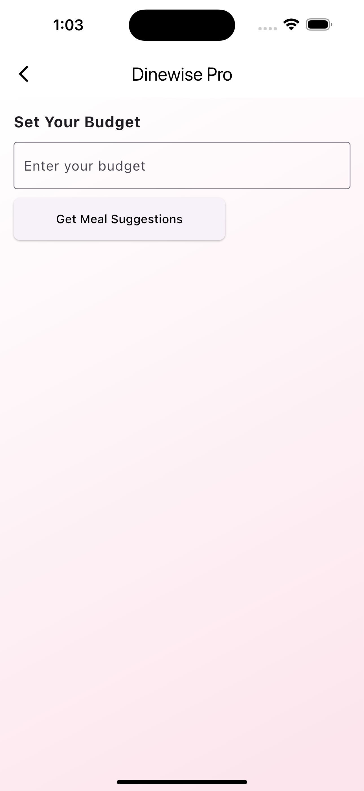
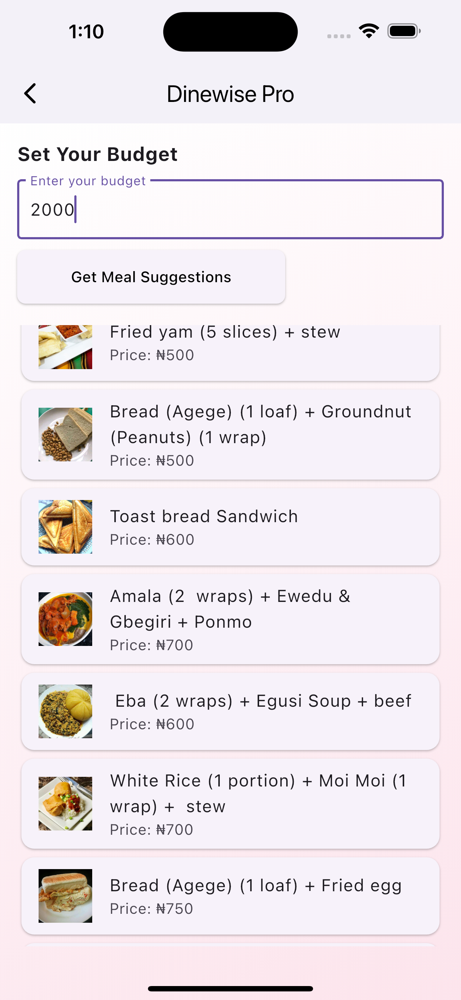

# DineWise Pro

## 📝 Project Description

**DineWise Pro** is a Java-based food recommendation system that helps users choose affordable meals while considering their nutritional value. Users input their budget, and the system suggests meals they can afford, each categorized according to how healthy they are. This ensures that users not only stay within budget but also make healthier food choices.

DineWise addresses two key challenges:

- **Budget-friendly meal planning**
- **Health-conscious eating**

Making it a practical tool for individuals looking to manage both their finances and nutrition.

## 📱 Features

- **Budget-based recommendations**: Get meal suggestions based on your available budget
- **Health ratings**: View nutritional information and health ratings for each meal
- **Cross-platform**: Works on Android, iOS, and web browsers
- **User-friendly interface**: Clean, intuitive design for easy navigation
- **Personalized recommendations**: Meal suggestions tailored to individual preferences

## 🛠️ Technologies Used

- **Frontend**: Flutter/Dart
- **Backend**: Java
- **API Communication**: RESTful APIs
- **Data Storage**: [Database technology used by the backend]

## 🚀 Installation

### Prerequisites

- Flutter SDK (latest version)
- Android Studio / Xcode
- Git

### Installation Steps

```bash
# Clone this repository
git clone https://github.com/yourusername/dinewise-pro.git

# Navigate to the project directory
cd dinewise-pro

# Install dependencies
flutter pub get

# Run the app
flutter run
```

## 📘 Frontend Methodology

### Development Approach

#### 1. Technology Stack Selection

The frontend development for DineWise Pro was built using:

- Flutter: For cross-platform development (Android, iOS, and web)
- Dart: Programming language for Flutter applications
- HTTP Package: For API communication with the backend
- Material Design Components: For consistent UI/UX design patterns

#### 2. Application Architecture

Implemented a simplified architecture with:

- Screen-based Organization
- StatefulWidget for local state
- HTTP client for API calls
- Platform-aware UI design

#### 3. User Interface Design

- **User-centered Design**
- **Consistent Color Scheme**: White, pink, and green accents
- **Responsive Layouts**
- **Clear Visual Hierarchy**

#### 4. Core Screens Development

##### 4.1 Splash Screen

- Brand-focused with animated text
- Timed navigation to onboarding screen

```dart
AnimatedOpacity(
  opacity: _opacity,
  duration: Duration(seconds: 3),
  child: Text.rich(
    TextSpan(
      children: [
        TextSpan(
          text: 'D',
          style: TextStyle(
            fontSize: 32,
            fontWeight: FontWeight.bold,
            color: Colors.green,
          ),
        ),
        TextSpan(
          text: 'inewise Pro',
          style: TextStyle(
            fontSize: 30,
            color: Colors.black,
            fontWeight: FontWeight.bold,
          ),
        ),
      ],
    ),
  ),
)
```

##### 4.2 Onboarding Screen

- Image carousel with controller
- Explanatory text and CTA button

```dart
SizedBox(
  height: 250,
  child: PageView.builder(
    controller: _pageController,
    itemCount: 2,
    itemBuilder: (context, index) {
      return Padding(
        padding: const EdgeInsets.symmetric(horizontal: 8.0),
        child: ClipRRect(
          borderRadius: BorderRadius.only(
            topRight: Radius.circular(12.0),
            bottomRight: Radius.circular(12.0),
          ),
          child: Image.asset(
            index == 0 ? 'images/Img2.png' : 'images/Img1.png',
            fit: BoxFit.cover,
          ),
        ),
      );
    },
  ),
)
```

##### 4.3 Recommendation Screen

- Budget input field with validation
- API connectivity
- List rendering of meal recommendations

```dart
String getBaseUrl() {
  if (Platform.isAndroid) {
    return 'http://10.0.2.2:8080';
  } else {
    return 'http://localhost:8080';
  }
}
```

#### 5. API Integration

- Platform-aware Base URL
- Asynchronous fetching
- JSON parsing and error handling

```dart
Future<void> fetchMealRecommendations(String budget) async {
  setState(() { isLoading = true; });

  final String apiUrl = '${getBaseUrl()}/api/recommendations?budget=$budget';

  try {
    final response = await http.get(Uri.parse(apiUrl));
    if (response.statusCode == 200) {
      setState(() {
        mealRecommendations = json.decode(response.body);
      });
    } else {
      ScaffoldMessenger.of(context).showSnackBar(
        SnackBar(content: Text('Failed to fetch recommendations')),
      );
    }
  } catch (e) {
    ScaffoldMessenger.of(context).showSnackBar(
      SnackBar(content: Text('Error: $e'))
    );
  } finally {
    setState(() { isLoading = false; });
  }
}
```

#### 6. UI/UX Enhancements

- Gradient Backgrounds
- Card-based UI
- Loading Indicators
- Responsive Buttons

```dart
Container(
  width: double.infinity,
  height: double.infinity,
  decoration: BoxDecoration(
    gradient: LinearGradient(
      colors: [Colors.white, Colors.pink.shade50],
      begin: Alignment.topLeft,
      end: Alignment.bottomRight,
    ),
  ),
)
```

### Testing Strategy

- Manual and cross-platform testing
- API integration tests
- UI responsiveness tests

## 💡 Challenges and Solutions

- **API Connectivity**: Platform-based URL logic
- **Async UI States**: Loading states and error messages
- **Responsive Design**: Layout adaptation using Flutter

## 👥 Contributors

- [Front_end Team] - Frontend Development
- [Backend_team] - Backend Development
- [Backend_Team] - API Development

## 🔄 Related Work

This project is inspired by:

- Nutritional guidance systems
- Budget management apps
- Meal planning tools
- Health-conscious platforms


## 📸 Screenshots
> 
> 
> 
> 

